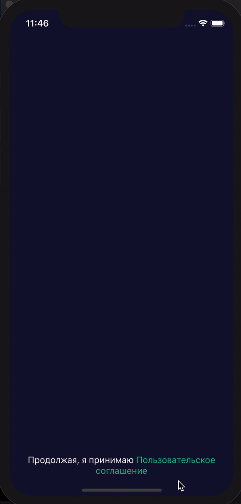

# TITransitions


Set of custom transitions to present controller. 

# PanelTransition
Use to present ViewController from the bottom.

## Usage
```swift 
let panelTransition = PanelTransition(presentStyle: .halfScreen)

let childController = UIViewController()
childController.view.backgroundColor = .white
       
childController.transitioningDelegate = panelTransition
childController.modalPresentationStyle = .custom

rootController.present(childController)
```
<p align="left">
  
</p>

## Customization 

To customize panel transition behaviour use the PanelTransition's constructor.
```swift
PanelTransition(presentStyle: PresentStyle, //required
                panelConfig: PanelPresentationController.Configuration = .default,
                driver: TransitionDriver? = .init(),
                presentAnimation: PresentAnimation = .init(),
                dismissAnimation: DismissAnimation = .init())
```
1. *PresentStyle* - defines a position of ViewController:
    - fullScreen
    - halfScreen
    - customInsets(UIEdgeInsets)
    - customHeight(CGFloat)

2. *PanelPresentationController.Configuration* - defines a background color of back view and a tap gesture:
```swift
struct Configuration {
  let backgroundColor: UIColor
  let onTapDismissEnabled: Bool
  let onTapDismissCompletion: VoidClosure?
```
3. *TransitionDriver* is responsible for swipe gesture.
4. *PresentAnimation and DismissAnimation* defines present and dismiss animations.

# Installation via SPM

You can install this framework as a target of LeadKit.

# License

TITransitions is available under the Apache License 2.0. See the LICENSE file for more info.
