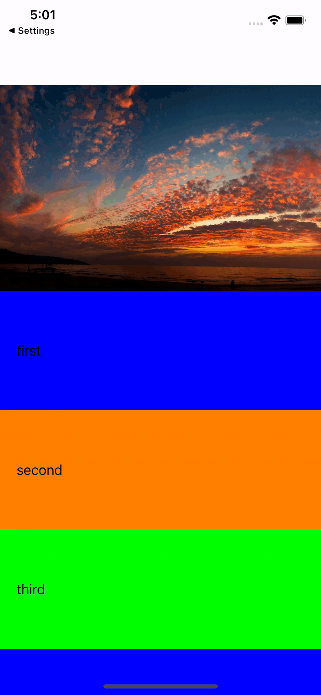
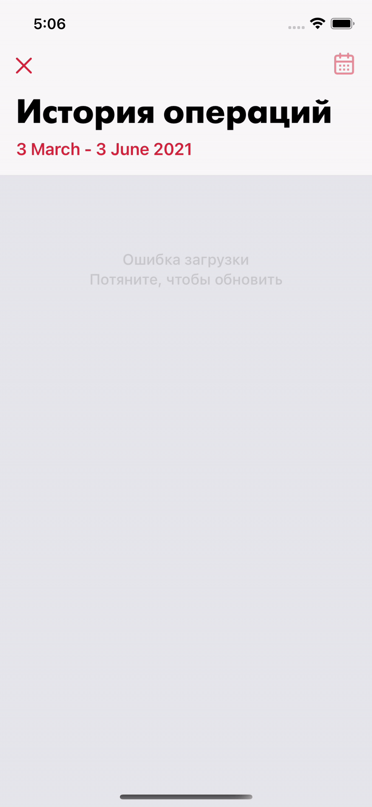

# TIUIElements

Bunch of useful protocols and views:

- `RefreshControl` - a basic UIRefreshControl with fixed refresh action.

# HeaderTransitionDelegate
Use for transition table header to navigationBar view while scrolling

## Your class must implement the HeaderViewHandlerProtocol protocol
```swift 
public protocol HeaderViewHandlerProtocol: UIViewController {
    var largeHeaderView: UIView? { get }
    var headerView: UIView? { get }
    var tableView: UITableView { get }
}
```

## Usage if your ViewController don't needs extend UITableViewDelegate
```swift 
let headerTransitionDelegate = HeaderTransitionDelegate(headerViewHandler: self)
tableView.delegate = headerTransitionDelegate
```

## Usage if your ViewController needs extend UITableViewDelegate
```swift 
let headerTransitionDelegate = HeaderTransitionDelegate(headerViewHandler: self)
tableView.delegate = self
.
.
func scrollViewDidScroll(_ scrollView: UIScrollView) {
    headerTransitionDelegate?.scrollViewDidScrollHandler(scrollView)
    
    /// Your local work
}
```

<table border="1" cellspacing="0" cellpadding="0">
    <tbody>
        <tr>
            <td>
                <p align="center" class="bold">
                     
                </p>
            </td>
            <td>
                <p align="center" class="bold">
                     
                </p>
            </td>
        </tr>
     </tbody>
</table>


# Installation via SPM

You can install this framework as a target of LeadKit.