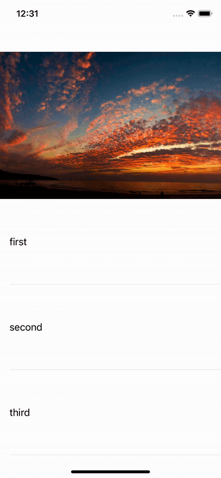

# TIUIElements

Bunch of useful protocols and views:

- `RefreshControl` - a basic UIRefreshControl with fixed refresh action.

# HeaderTransitionDelegate
Use for transition table header to navigationBar view while scrolling

## Your class must implement HeaderViewHandlerProtocol protocol

## HeaderViewHandlerProtocol
```swift 
public protocol CollapsibleViewsContainer: class, TableViewHandler {
    var topHeaderView: UIView? { get } // titleView
    var bottomHeaderView: UIView? { get } // tableHeaderView

    var fixedTopOffet: CGFloat { get } // status bar + nav bar height
    var navBar: UINavigationBar? { get }
    
    var tableView: UITableView { get }
}
```

UIViewController have default realization for fixedTopOffet (defaultTopOffet). 
If you are satisfied default realization You can implement fixedTopOffet like this  
```swift 
var fixedTopOffet: CGFloat {
    defaultTopOffet
}
```

UIViewController have default realization for navBar
```swift 
public var navBar: UINavigationBar? {
    navigationController?.navigationBar
}
```

## Usage if your ViewController don't needs extend UITableViewDelegate
```swift 
let headerTransitionDelegate = HeaderTransitionDelegate(headerViewHandler: self)
tableView.delegate = headerTransitionDelegate
```

## Usage if your ViewController needs extend UITableViewDelegate
```swift 
let headerTransitionDelegate = HeaderTransitionDelegate(headerViewHandler: self)
tableView.delegate = self
.
.
func scrollViewDidScroll(_ scrollView: UIScrollView) {
    headerTransitionDelegate?.scrollViewDidScrollHandler(scrollView)
    
    /// Your local work
}
```

## Customization 
You can use different kinds of animations to change views
```swift
HeaderTransitionDelegate(headerViewHandler: HeaderViewHandlerProtocol,
                         headerAnimationType: HeaderAnimationType = .paralaxWithTransition)
```
1. *headerAnimationType* - определяет тип анимации перехода отображений:
    - **onlyParalax** - applies only parallax effect to the header of table
    - **paralaxWithTransition** - applies parallax effect to the header of table with transition effect down up of the navigationBar titleView
    - **transition** - applies only transition effect down up of the navigationBar titleView
    - **scale** - applies only scale effect down up of the navigationBar titleView
    - **paralaxWithScale** - applies parallax effect to the header of table with scale effect down up of the navigationBar titleView
    - **none** **(default value)** - dont applies any effects 
## Examples
#### **none**
<table border="0" cellspacing="30" cellpadding="30">
    <tbody>
        <tr>
            <td>
                <p align="left">
                     
                </p>
            </td>
            <td>
                <p align="right">
                     
                </p>
            </td>
        </tr>
     </tbody>
</table>

#### **onlyParalax**
<p align="left">
     
</p>

#### **paralaxWithTransition**
<p align="left">
     
</p>

#### **transition**
<p align="left">
     
</p>

#### **scale**
<p align="left">
     
</p>

#### **paralaxWithScale**
<p align="left">
     
</p>
                
# Installation via SPM

You can install this framework as a target of LeadKit.
