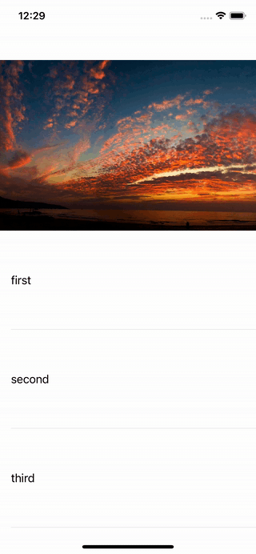
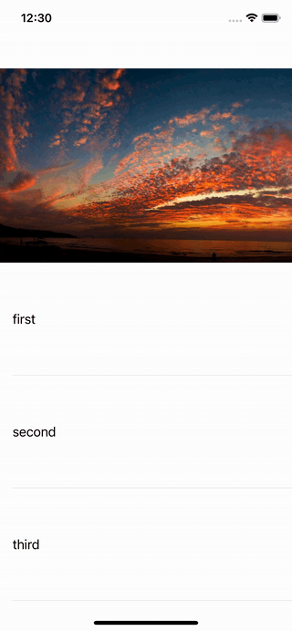

# TIUIElements

Bunch of useful protocols and views:

- `RefreshControl` - a basic UIRefreshControl with fixed refresh action.

# HeaderTransitionDelegate
Use for transition table header to navigationBar view while scrolling

## Your class must implement CollapsibleViewsContainer protocol

## HeaderViewHandlerProtocol
```swift 
public protocol CollapsibleViewsContainer {
    var topHeaderView: UIView? { get } // titleView
    var bottomHeaderView: UIView? { get } // tableHeaderView

    var fixedTopOffet: CGFloat { get } // status bar + nav bar height
}
```

UIViewController have default realization for fixedTopOffet. 

## TransitioningHandler
TransitioningHandler Binds animators to the container.
```swift
public protocol TransitioningHandler: UIScrollViewDelegate {
    var animator: CollapsibleViewsAnimator? { get set }

    init(collapsibleViewsContainer: CollapsibleViewsContainer)
}
```

## Customization 
You can use both the various types of animation already implemented to change the view, or create your own. To create an animator, you need to implement the CollapsibleViewsAnimator protocol.
```swift
public protocol CollapsibleViewsAnimator {
   var fractionComplete: CGFloat { get set } // progress of animation
   var currentContentOffset: CGPoint { get set } // offset on content in table view/collection view or plain scroll view
}
```

Already implemented animators

- `ParalaxAnimator` - applies only parallax effect to the header of table
- `ParalaxWithTransitionAnimator` - applies parallax effect to the header of table with transition effect down up of the navigationBar titleView
- `TransitionAnimator` - applies only transition effect down up of the navigationBar titleView
- `ScaleAnimator` - applies only scale effect down up of the navigationBar titleView
- `ParalaxWithScaleAnimator` - applies parallax effect to the header of table with scale effect down up of the navigationBar titleView
- `nil`(default value) - dont applies any effects 

TableViewHeaderTransitioningHandler is the default implementation for TransitioningHandler. It creates an animation action when scrolling the table.

## Usage default realization with tableView
```swift 
class ViewController: UITableViewController, CollapsibleViewsContainer {
    private lazy var handler = TableViewHeaderTransitioningHandler(collapsibleViewsContainer: self)
    
    private lazy var parallaxTableHeaderView = ParallaxTableHeaderView(wrappedView: bottomHeaderView ?? UIView())

    var topHeaderView = SomeCustomTopView()

    var bottomHeaderView = SomeCustomBottomView()

    func addViews() {
        tableView.tableHeaderView = parallaxTableHeaderView
        navigationController?.navigationBar.topItem?.titleView = topHeaderView
    }
    
    func bindViews() {
        handler.animator = ParalaxWithTransitionAnimator(tableHeaderView: parallaxTableHeaderView,
                                                         navBar: navigationController?.navigationBar,
                                                         currentContentOffset: tableView.contentOffset)

        tableView.delegate = self
        tableView.dataSource = self
    }
    
    override func scrollViewDidScroll(_ scrollView: UIScrollView) {
        handler.scrollViewDidScroll(scrollView)
    }
}

```

## Examples
#### **none**
<table border="0" cellspacing="30" cellpadding="30">
    <tbody>
        <tr>
            <td>
                <p align="left">
                     
                </p>
            </td>
            <td>
                <p align="right">
                     
                </p>
            </td>
        </tr>
     </tbody>
</table>

#### **onlyParalax**
<p align="left">
     
</p>

#### **paralaxWithTransition**
<p align="left">
     
</p>

#### **transition**
<p align="left">
     
</p>

#### **scale**
<p align="left">
     
</p>

#### **paralaxWithScale**
<p align="left">
     
</p>
  
# AlertsFactory
Use to present alerts in a few lines of code. Can be used for UIKit and SwiftUI
> You can initialize `AlertsFactory` with your own *LocalizationProvider* or use `DefaultAlertLocalizationProvider`

## Your view or view controller must implement PresentationContext protocol
There are `UIKitContext` and `SwiftUIContext` protocols that are designed to make it easier to work with `PresentationContext` protocol. By default, no changes need to be made for UIKit view controllers and SwiftUI views to make them conform to these protocols

## Custom alerts
```swift
// Presents alert
func presentAlert() {
    factory
        .alert(title: "Alert's title",
               message: "Alert's message",
               tint: .systemBlue,
               actions: [
                   AlertAction(title: "Ok", style: .default, action: nil),
                   AlertAction(title: "Cancel", style: .cancel, action: nil)
               ])
        .present(on: self)
}

// Presents sheet alert
func presentSheetAlert() {
    factory
        .sheetAlert(title: "Alert's title",
               message: "Alert's message",
               tint: .systemBlue,
               actions: [
                   AlertAction(title: "Ok", style: .default, action: nil),
                   AlertAction(title: "Cancel", style: .cancel, action: nil)
               ])
        .present(on: self)
}
```

## Default alerts
```swift
// Ok alert
func presentOkAlert() {
    factory
        .okAlert(title: "Title", message: "Message")
        .present(on: self)
}

// Retry alert
func presentRetryAlert() {
    factory
        .retryAlert(title: "Title", message: "Message") { [weak self] in
            self?.presentOkAlert()
        }
        .present(on: self)
}

// Dialogue alert
func presentDialogueAlert() {
    factory
        .dialogueAlert(title: "Title", message: "Message")
        .present(on: self)
}
```

## SwiftUI alerts
```swift
var body: some View {
    Button("Show custom alert with binding property") {
            alertDescription = factory.okAlert(title: "Title", message: "Message")
            isPresentedCustomAlert = true
        }
    }
    .alert(isPresented: $isPresentedAlert, on: self, alert: alertDescription)
}
```

# Installation via SPM

You can install this framework as a target of LeadKit.
